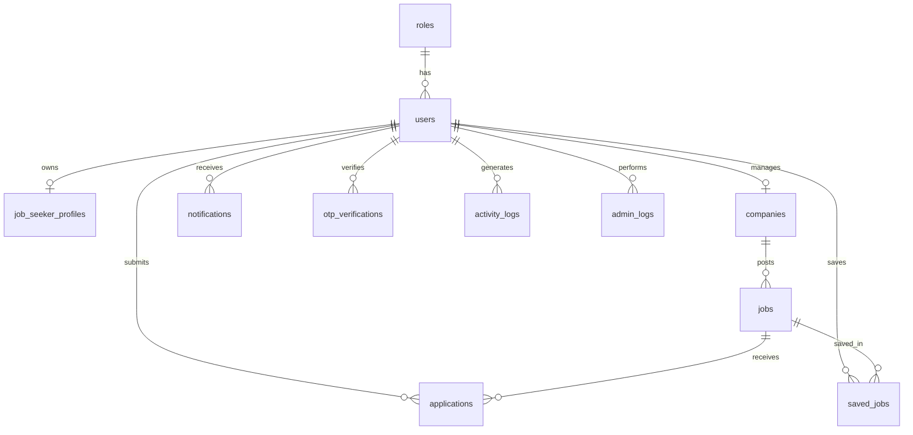

# Database ER Diagram — SmartHire Pro

## Table Relationships

| Parent | Child | Relationship |
|--------|-------|--------------|
| roles | users | One role, many users |
| users | job_seeker_profiles | One-to-one (job seekers) |
| users | companies | One recruiter, one company |
| companies | jobs | One company, many jobs |
| jobs + users | applications | Many-to-many via applications |
| users + jobs | saved_jobs | Many-to-many via saved_jobs |

See `database/schema.sql` for full column definitions and constraints.
